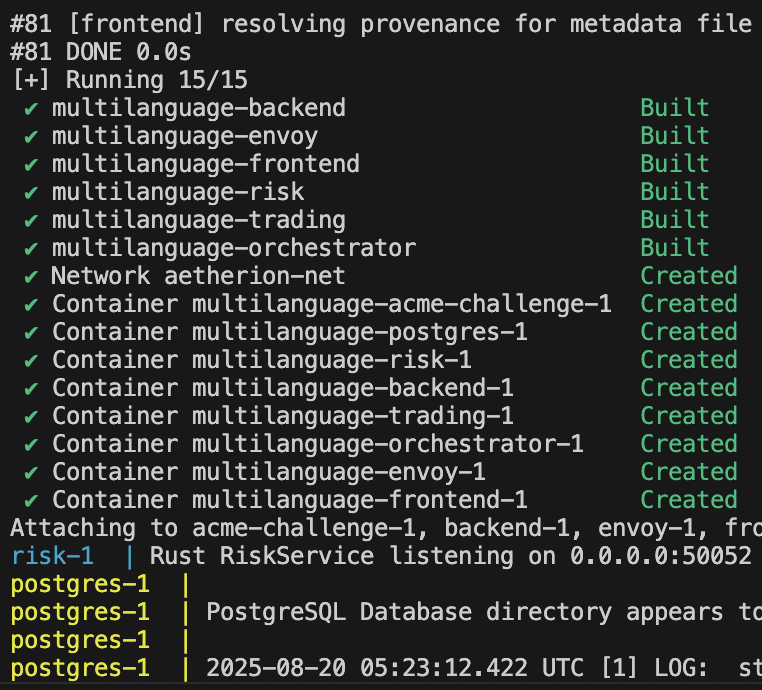
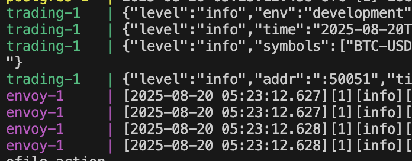

# Aetherion Trading Platform

Aetherion is a high-performance, multi-language trading platform built on a robust microservices architecture. It's designed for speed, flexibility, and reliability, leveraging Docker for seamless containerization and orchestration.

## Key Features

*   **Real-Time Market Data:** Live cryptocurrency price feeds empower rapid, informed trading decisions.
*   **Polyglot Microservices:** Each service is crafted in the optimal language for its domain—Rust for high-performance risk analytics, Go for core trading logic, and Python for backtesting and orchestration.
*   **Service Mesh Integration:** Envoy proxy ensures secure, high-performance, and resilient service-to-service communication.
*   **Modern User Experience:** A sophisticated React-based web interface provides an intuitive command center for traders.
*   **Intelligent Orchestration:** A dedicated service coordinates complex trading operations and automated strategies.
*   **Persistent Data Storage:** Trading activities and analytical data are securely stored in a PostgreSQL database.

## Architecture Overview

Aetherion's architecture consists of the following containerized services:

*   **`frontend`**: (React) The user interface for traders.
*   **`envoy`**: (Envoy Proxy) The service mesh proxy, handling gRPC-Web translation and routing to backend services.
*   **`trading`**: (Go) The core trading logic, including order book management, price feeds, and user authentication.
*   **`risk`**: (Rust) High-performance risk management and analytics.
*   **`orchestrator`**: (Python) Manages and executes complex trading strategies.
*   **`backend`**: (Python/FastAPI) Provides the backtesting API for strategies.
*   **`postgres`**: (PostgreSQL) Data persistence for trading activities and analytical data.

## Core Technologies

*   **Backend:** Rust, Go, Python
*   **Frontend:** JavaScript/React
*   **API:** gRPC & Protobuf
*   **Database:** PostgreSQL
*   **Proxy:** Envoy
*   **Containerization:** Docker & Docker Compose

## Getting Started

To launch the entire Aetherion platform, ensure you have Docker installed and running, then execute the following command from the project root:

```bash
docker-compose up --build
```

Once the services are running, you can access the frontend at [http://localhost:3000](http://localhost:3000).

For more detailed setup instructions, see the [Developer Documentation](DEVELOPER.md).

## Contributing

We welcome contributors! Aetherion is an open-source project, and we'd love your help building the future of trading technology.

*   **Read the Docs:** Check out the [Developer Documentation](DEVELOPER.md) and the [Strategy Contributor Guide](STRATEGIES.md).
*   **Find an Issue:** Look for open issues on our GitHub repository.
*   **Submit a Pull Request:** We're excited to see your contributions!

## Live Console Output

Observe Aetherion in action. Below are snapshots illustrating active services, real-time BTC price fetching, and live trading logs.





> **Note:** Should you encounter SSL certificate errors, consider commenting out the `.pem` certificates and utilizing the alternate certificates specified in `envoy.yaml`.
