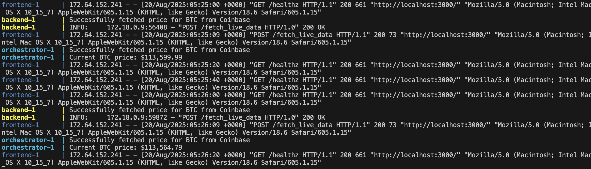
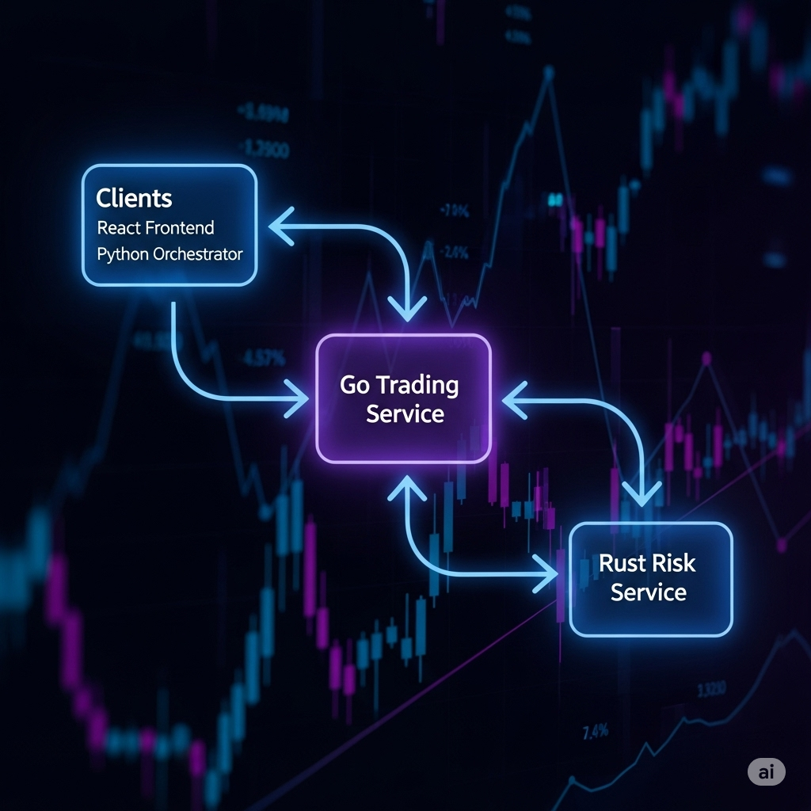

# Aetherion Trading Platform

**A high-performance, polyglot microservices platform for algorithmic cryptocurrency trading.**

[](https://github.com/xeratooth/multilanguage)
[](https://github.com/xeratooth/multilanguage)
[](https://discord.gg/aetherion)
[](https://twitter.com/aetherion)

Aetherion is a feature-rich trading platform designed for speed, flexibility, and reliability. It leverages a robust microservices architecture, with each service crafted in the optimal language for its domain—Rust for high-performance risk analytics, Go for core trading logic, and Python for backtesting and orchestration.

## Gallery

**Aetherion Dashboard:**


**System Architecture:**


## Key Features

*   **Real-Time Market Data:** Live cryptocurrency price feeds for rapid, informed trading decisions.
*   **Algorithmic Trading:** Develop and deploy custom trading bots and strategies.
*   **Advanced Risk Management:** Integrated Value at Risk (VaR) calculations to monitor and manage portfolio risk.
*   **Comprehensive Backtesting:** A Python-based engine to test strategies against historical data.
*   **Polyglot Microservices:** A blend of Rust, Go, and Python for optimal performance and functionality.
*   **Modern User Experience:** A sophisticated React-based web interface provides an intuitive command center for traders.
*   **Secure & Resilient:** Employs Envoy proxy for a secure service mesh, JWT for authentication, and provides detailed security guidelines.

## Architecture Overview

Aetherion's architecture is composed of containerized microservices that communicate via gRPC.

*   **`frontend`**: (React) The user interface for traders.
*   **`envoy`**: (Envoy Proxy) The service mesh proxy, handling gRPC-Web translation and routing.
*   **`trading`**: (Go) Core trading logic, order book management, price feeds, and user authentication.
*   **`risk`**: (Rust) High-performance risk management and analytics.
*   **`orchestrator`**: (Python) Manages and executes complex trading strategies.
*   **`backend`**: (Python/FastAPI) Provides the backtesting API for strategies.
*   **`postgres`**: (PostgreSQL) Data persistence for trading activities and analytical data.

For more details, see the [architecture diagram](#gallery).

## Technology Stack

| Category          | Technologies                                       |
| ----------------- | -------------------------------------------------- |
| **Backend**       | Go, Rust, Python (FastAPI)                         |
| **Frontend**      | JavaScript, React                                  |
| **API**           | gRPC, Protobuf, gRPC-Web                           |
| **Database**      | PostgreSQL                                         |
| **Proxy**         | Envoy                                              |
| **Containerization**| Docker, Docker Compose                             |

## Roadmap

Our vision is to make Aetherion the most powerful and user-friendly open-source trading platform. Here's what we're planning for the future:

- [ ] **Enhanced Strategy Marketplace:** A place for users to share and discover trading strategies.
- [ ] **Mutual TLS (mTLS):** For even more secure inter-service communication.
- [ ] **Advanced Charting:** More powerful charting tools and technical indicators.
- [ ] **Expanded Exchange Support:** Integration with more cryptocurrency exchanges.
- [ ] **AI-Powered Insights:** Leveraging machine learning for market predictions and sentiment analysis.

## Getting Started

To launch the Aetherion platform, ensure you have Docker and Docker Compose installed, then run the following command from the project root:

```bash
docker-compose up --build
```

Once the services are running, you can access the frontend at [http://localhost:3000](http://localhost:3000).

For more detailed setup instructions, see the [Developer Documentation](DEVELOPER.md).

## Contributing

We welcome contributors! Aetherion is an open-source project, and we'd love your help building the future of trading technology.

*   **Read the Docs:** Check out the [Developer Documentation](DEVELOPER.md) and the [Strategy Contributor Guide](STRATEGIES.md).
*   **Find an Issue:** Look for open issues on our GitHub repository.
*   **Submit a Pull Request:** We're excited to see your contributions!

## Community & Support

*   **Discord:** Join our [Discord server](https://discord.gg/aetherion) to chat with other users and developers.
*   **GitHub Issues:** If you encounter a bug or have a feature request, please [file an issue](https://github.com/xeratooth/multilanguage/issues).

## License

This project is licensed under the MIT License - see the [LICENSE](LICENSE) file for details.
